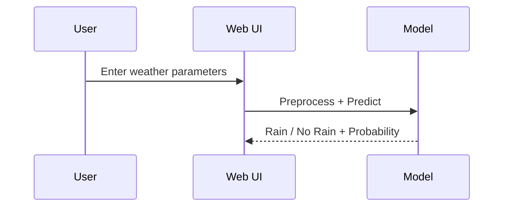

# Rainfall Prediction (ML + Flask)

## Overview
This project predicts whether it will rain tomorrow using weather observations. It includes a full machine learning pipeline (data cleaning, preprocessing, visualization, model training/evaluation) and a Flask web app for interactive predictions.

## What We Used
- **Language**: Python
- **Libraries**: pandas, numpy, scikit-learn, xgboost, matplotlib, seaborn, Flask
- **Artifacts**: model, scaler, imputers, encoders serialized as .pkl
- **Data**: Weather.csv - Dataset.csv

## Project Structure
```
APSCHE/
├── IBM_endpoint_deploy/
│   ├── app.py
│   ├── rainfall.pkl
│   ├── scale.pkl
│   ├── impter.pkl
│   ├── cat_impter.pkl
│   ├── encoder.pkl
│   ├── feature_names.pkl
│   └── templates/
│       ├── index.html
│       ├── chance.html
│       ├── noChance.html
│       └── error.html
├── Rainfall_prediction/
│   └── rainfall_prediction_model.ipynb
├── Weather.csv - Dataset.csv
├── requirements.txt
└── README.md
```

## Approach / Solution
1. **Data Collection**: Load the CSV dataset.
2. **Data Cleaning**: Drop high-missing columns, remove rows with missing target, fill missing `RainToday`.
3. **Imputation**: Fill numeric columns with mean and categorical with mode; ensure no NaN values remain.
4. **Encoding**: Label-encode categorical features.
5. **Visualization**: Correlation heatmap, distributions, and box plots.
6. **Scaling**: Standardize features using StandardScaler.
7. **Modeling**: Train Logistic Regression, Decision Tree, Random Forest, SVM, KNN, and XGBoost.
8. **Evaluation**: Compare accuracy and ROC-AUC; select the best model.
9. **Deployment**: Save model + preprocessors and serve predictions via Flask.

## Pipeline Diagram


## Web App Flow


## How to Run
### 1) Install dependencies
```
pip3 install -r requirements.txt
```

### 2) Run the notebook
Open the notebook and run all cells:
- [Rainfall_prediction/rainfall_prediction_model.ipynb](Rainfall_prediction/rainfall_prediction_model.ipynb)

This will generate all .pkl files in [IBM_endpoint_deploy](IBM_endpoint_deploy).

### 3) Start the Flask app
```
cd IBM_endpoint_deploy
python3 app.py
```
Then open http://127.0.0.1:5000

## Common Errors and Fixes
### 1) `Input X contains NaN` during training
**Cause**: Missing values not fully imputed.
**Fix**: Ensure all numeric columns are filled with mean and categorical columns with mode in the imputation step before encoding.

### 2) `Columns must be same length as key` or shape mismatch during imputation
**Cause**: Assigning NumPy arrays from `SimpleImputer` directly to a DataFrame with mismatched column counts.
**Fix**: Use `fillna()` per column or ensure the DataFrame columns match the imputer output exactly.

### 3) XGBoost import error on macOS
**Cause**: Missing OpenMP runtime.
**Fix**:
```
brew install libomp
```

### 4) Flask app errors due to missing .pkl files
**Cause**: Notebook not run fully or artifacts not saved.
**Fix**: Run all notebook cells; verify files exist in [IBM_endpoint_deploy](IBM_endpoint_deploy).

### 5) Categorical encoding errors
**Cause**: New category not present during training.
**Fix**: Fallback to a known class or default in the encoder (already handled in the app).

## Frequently Missed Steps
- **Running all notebook cells**: Required to generate .pkl files.
- **Correct feature order**: Must match the trained model order.
- **Using the same preprocessing**: Scaler, imputers, and encoders must be the same as training.

## Notes
- The UI expects weather parameter inputs because the model uses 16 features.
- The app supports both form-based UI and a JSON API endpoint at `/api/predict`.

## API Example
```
curl -X POST http://127.0.0.1:5000/api/predict \
  -H "Content-Type: application/json" \
  -d '{
    "MinTemp": 12.3,
    "MaxTemp": 24.7,
    "Rainfall": 0.0,
    "WindGustDir": "W",
    "WindGustSpeed": 40,
    "WindDir9am": "NW",
    "WindDir3pm": "W",
    "WindSpeed9am": 12,
    "WindSpeed3pm": 18,
    "Humidity9am": 65,
    "Humidity3pm": 45,
    "Pressure9am": 1012.4,
    "Pressure3pm": 1010.2,
    "Temp9am": 16.5,
    "Temp3pm": 22.0,
    "RainToday": "No"
  }'
```
